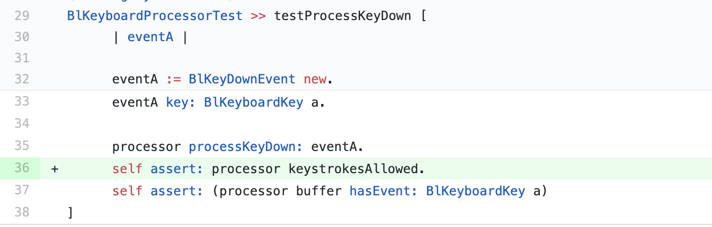

## Bloc

We sent a [pull-request](https://github.com/feenkcom/Bloc/pull/7) to this project containing the suggestion  for adding a new assertion in an existing test method  in the test class `BlKeyboardProcessorTest`.
The suggested test method is shown in figure below. 
By calling the state revealer method `#keystrokesAllowed`, this assertion verifies the correctness of the object state after an `#processKeyDown:` event.

The pull-request was also merged after a few weeks with a positive comment.

