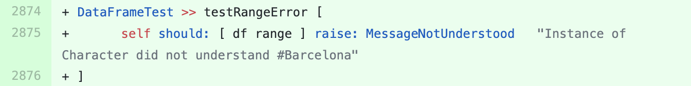

## DataFrame

We sent a [pull-request](https://github.com/PolyMathOrg/DataFrame/pull/132) to this project containing the suggestion  for adding a new test method in the test class `DataFrameTest`.
The suggested test method is shown in the figure below. 

The variable `df` is an instance variable that has been initialized in the `#setUp` method.
It includes a tabular data mixed from numbers and texts.

This test method makes it explicit that calling the method `#range` on a DataFrame object containing non-numerical columns throws an exception.
With this new test it becomes an explicit part of the contract for DataFrame.

The pull-request was merged after a few weeks.
A developer of the project commented: *Small-amp seems to be a very valuable tool!*

