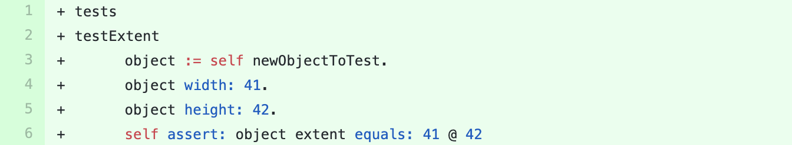

# DiscordSt

We sent a [pull-request](https://github.com/JurajKubelka/DiscordSt/pull/75) to this project containing the suggestion  for adding a new test method in the test class `DSEmbedImageTest`.
The suggested test method is shown in figure below.

The method covers the method `#extent` which was not covered in the test class before.
The pull-request was merged after a few days.

