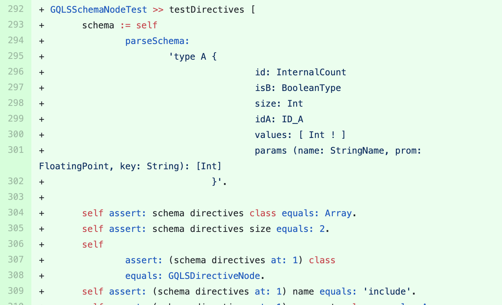

## GraphQL

We sent a [pull-request](https://github.com/OBJECTSEMANTICS/GraphQL/pull/12) to this project containing the suggestion  for adding a new test method in the test class `GQLSSchemaNodeTest`.
The suggested test method is shown in the figure below. 

This test method verifies the return value of `directives` in a `schema` object.
The returned value is generated in the method `GQLSSchemaNode $>$$>$ initializeDefaultDirectives` and contains technical debt. 
This test method guards against future evolutions which may break assumptions made by clients.

The pull-request was merged after a few days.

