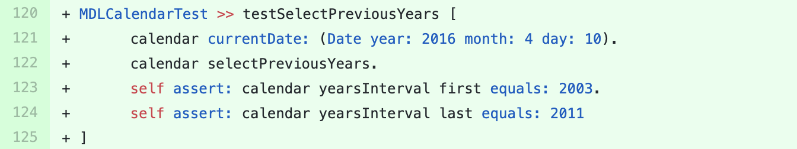

## MaterialDesignLite

We sent a [pull-request](https://github.com/DuneSt/MaterialDesignLite/pull/308) to this project containing the suggestion for adding two new test methods  in the test class `MDLCalendarTest`.
The suggested test methods are shown in figures below.

Both of test methods are similar and are created by adding a new method call to the test input.
The tests are created for the `Calendar` widget and verify correctness of `#selectPreviousYears` and `#selectNextYears` methods.

The pull-request was merged the day after.

