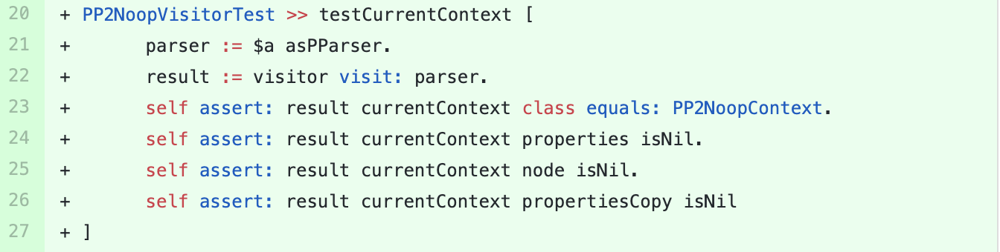

## PetitParser2

We sent a [pull-request](https://github.com/kursjan/petitparser2) to this project containing the suggestion  for adding a new test method  in the test class `PP2NoopVisitorTest`.
The suggested test method is shown in the figure below. 

The test method tests the value of `currentContext` in `result` object.
The pull-request is not merged up to the date of  writing this paper.

