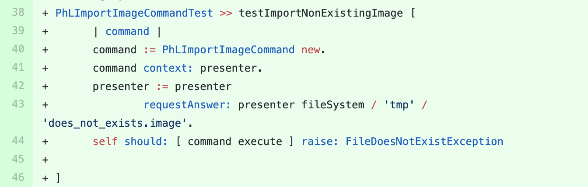

## Pharo-Launcher

We sent a [pull-request](https://github.com/pharo-project/pharo-launcher/pull/500) to this project containing the suggestion  for adding a new test method in the test class `PhLImportImageCommandTest`.
The suggested test method is shown in the figure below. 

This test is produced from the original test method of `testCanImportAnImage` which verifies an image can be imported using a valid filename.
SmallAmp applies a literal mutation on the file name (`'foo.image'` changed to `'fo.image'`) that results an invalid filename and consequently raising a `FileDoesNotExistException` error. 
Before sending the pull-request, we selected meaningful names for the name of the test method and the file.

The pull-request was merged in the same day with this comment: *Indeed, the test you are adding has a value. Good job SmallAmp*.

