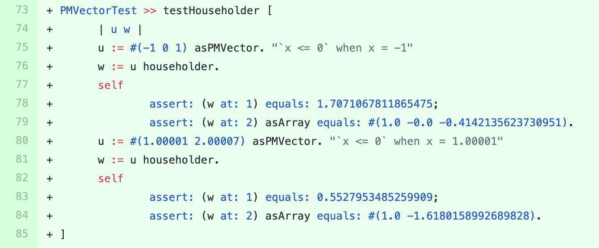

## PolyMath

We sent a [pull-request](https://github.com/PolyMathOrg/PolyMath/pull/178) to this project containing the suggestion  for adding a new test method in the test class `PMVectorTest`.
The suggested test method is shown in the figure below. 

This test method is testing the call of the method `#householder` on two different vectors.
Before this test, the method `#householder` was not covered in this test class.

The *method-call-adder* input amplifier adds calling to this method in different test methods.
We included two of them in a new test method that execute two different branches in the test method (based on the condition `x <= 0`).
The former vector (line 75 in the figure) forces the `ifTrue` branch and the latter vector (line 80 in the figure) forces `ifFalse` branch.
Note that the comment text (line 75) is added manually to increase the readability of the test. 

The original test method included two assertions to confirm the type of the returned value of the method (`self assert: w class equals: Array`).
The developers asked us to omit these assertion statements, because it was exposing an implementation detail.
We changed the pull request accordingly and it was merged immediately.

