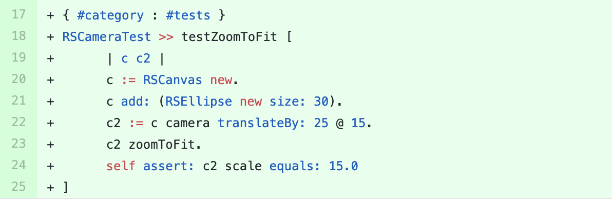

## Roassal3

We sent a [pull-request](https://github.com/ObjectProfile/Roassal3/pull/340) to this project containing the suggestion  for adding a new test method  in the test class `RSCameraTest` called `#testZoomToFit`.
The suggested test method is shown in the figure below. 

This test method is derived from an original test called `#testPosition`, and covers the method `RSCamera>> #zoomToFit`, which was not covered by `RSCameraTest`.

The pull-request merged with the comment: *Thanks! Your test makes sense*.

