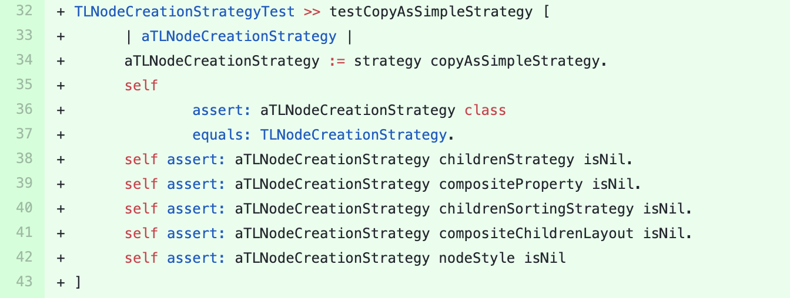

## Telescope

We sent a [pull-request](https://github.com/TelescopeSt/Telescope) to this project containing the suggestion  for adding a new test method  in the test class `TLNodeCreationStrategyTest`.
The suggested test method is shown in figure below. 

The test method verifies the state of the returned object from calling `copyAsSimpleStrategy`.
This method is never covered in the test class.
It also contain technical debt.

The pull-request is not merged up to the date of  writing this paper.
