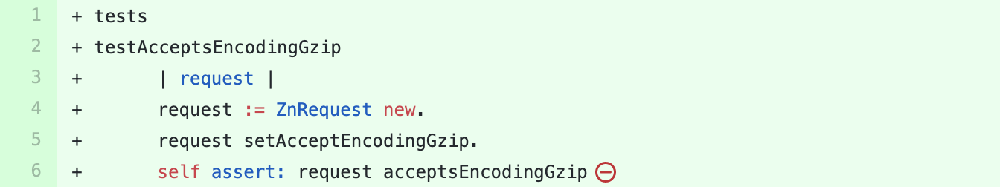

## Zinc

We sent a [pull-request](https://github.com/svenvc/zinc/pull/58) to this project containing the suggestion  for adding a new test method in the test class `ZnRequestTest`.
The suggested test method is shown in the figure below. 

This test method calls the method `#setAcceptEncodingGzip` on an `request` object.
Then calls another method `#acceptsEncodingGzip` to verify the change.
Both of these methods were not covered in this test class before this test method.

This method is built by cooperating three module of SmallAmp.
First, *method-call-adder* input amplifier adds a new method call.
Then *assertion amplification* inserts a set of new assertions after the added method call.
And finally, after the main amplification loop is finished, the *assertion reducer* rejects all superfluous assertion statements.

The pull-request was merged in the same day.
